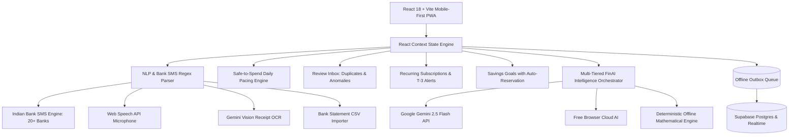

# ClearSpend — Complete Product Architecture & User Guide

> **An AI-First, Privacy-Conscious Personal Finance Copilot & Envelope Budgeting System**  
> *Built with React 18, TypeScript, Tailwind CSS, Recharts, Free Cloud AI & Google Gemini 2.5 Flash.*

---

## 🌟 1. Executive Summary & Vision

### The Problem
Most personal expense trackers fail within 30 days because of five core pain points:
1. **Manual Entry Friction:** Filling out 6 form fields (Date, Amount, Category, Wallet, Merchant, Notes) for every ₹20 chai or ₹380 lunch quickly leads to user abandonment.
2. **Untrusted Data & Duplicates:** Bank SMS feeds and manual entries frequently double-count transactions or mislabel credit card bill payments as new expenses or income.
3. **Passive Rearview Insights:** Standard trackers show static rearview charts after the month has already been blown.
4. **Uncertain Commitments:** Users lack visibility into how much of their paycheck is already locked in fixed subscriptions, rent, and EMIs.
5. **Discretionary Spending Blindness:** Users underestimate how small avoidable daily spends accumulate into massive lost wealth.

### The ClearSpend Solution
**ClearSpend** transforms expense tracking into a friction-free, intelligent, and rewarding daily habit:
- **Zero-Typing Multi-Modal Capture:** Instant one-line natural language, Indian Bank SMS parser for 20+ banks, microphone voice input, receipt camera OCR, and statement CSV import.
- **Review Inbox Defense:** Automatically flags duplicate swipes within 120-second windows and highlights statistical spending anomalies (>3x category median).
- **Safe-to-Spend Daily Pacing Engine:** Dynamically calculates your daily allowance:
  $$\text{Safe to Spend Today} = \frac{\text{Monthly Flexible Budget} - \text{Spent So Far} - \text{Savings Goals Reserved}}{\text{Days Remaining in Month}}$$
- **50/30/20 Committed vs Free Money:** Centralized register of fixed commitments (rent, subscriptions, EMIs) with proactive T-3 day auto-debit alerts.
- **100% Data-Grounded FinAI Copilot:** A multi-tiered AI assistant powered by Google Gemini 2.5 Flash and Free Browser Cloud AI answering exact queries using your live ledger numbers.
- **Power of Compounding Visualizer:** Shows how redirecting ₹2,000/month into index funds compounds into ₹20+ Lakhs over 10-20 years.

---

## 🏛️ 2. System Architecture & Tech Stack

### Core Technologies
- **Frontend Framework:** React 18 with TypeScript and Vite.
- **Styling & Design System:** Tailwind CSS with custom dark mode, glassmorphism backdrops, and micro-animations.
- **Data Visualizations:** Recharts (Area charts, Stacked Bar charts, Pacing meters, Compounding trajectories).
- **Data Layer:** Offline-first architecture with Outbox synchronization and Supabase Postgres Realtime subscriptions.
- **Testing:** Vitest unit test suite with 100% pass rate.

---

## 🚀 3. Comprehensive Feature Walkthrough

### 3.1 Zero-Typing Multi-Modal Capture
1. **One-Line Natural Language Bar:**
   - Type *"380 zomato lunch"* or *"2.2k shell petrol"*.
   - Understands Indian shorthand (`2k`, `1.5k`, `1.2l`, `₹`, `rs`).
   - Resolves relative dates (`yesterday`, `last friday`, `day before yesterday`).
2. **Indian Bank SMS Parser:**
   - Paste or share SMS from HDFC, SBI, ICICI, Axis, Kotak, PhonePe, Paytm, CRED.
   - Automatically extracts amount, debit/credit kind, merchant name, account suffix, and timestamp.
3. **Voice Input (Web Speech API):**
   - Tap the microphone button in the Quick-Add bar.
   - Speak naturally (*"Paid five hundred rupees for groceries at DMart"*).
   - Live floating transcript pill finalizes automatically on silence.
4. **Receipt Scanner (Gemini Vision OCR):**
   - Snap or upload a receipt photo.
   - Serverless Gemini Vision edge function extracts line items, total amount, merchant, and tax.
5. **CSV Bank Statement Importer:**
   - Upload bank statement CSVs from any bank.
   - Auto-detects delimiters (comma, semicolon, tab) and column mappings.
   - Pre-scans and flags duplicate entries before importing.

### 3.2 Safe-to-Spend Pacing & Streaks
- **Hero Daily Allowance Card:** Prominently displays how much you can safely spend today without exceeding monthly limits.
- **Calculation Explainer Modal:** Step-by-step interactive breakdown of total budget, money spent, committed subscriptions, reserved savings goals, and days remaining.
- **Streak Tracker:** Tracks consecutive days logged.
- **"No spend today 🎉" Button:** Zero-friction one-tap button logging a clean ₹0 day with milestone confetti.
- **Push Notification Reminders:** Customizable daily notifications via Service Worker.

### 3.3 Budgets & Committed Money
- **Category Envelopes:** Set monthly limits with alert thresholds (e.g. 80% caution zone).
- **Committed vs Free Money Card:** 50/30/20 rule breakdown:
  - Fixed Needs (Rent, Utilities, Subscriptions)
  - Savings Goals (Monthly auto-reserved allocations)
  - True Discretionary Free Pool
- **5-Month Velocity Trends:** Multi-month Area and Stacked Bar charts tracking financial progression across April, May, June, July, and August 2026.
- **Interactive Pacing Simulator:** Test spending adjustments (-30% to +30%) to simulate impact on month-end savings.

### 3.4 Recurring Subscriptions Register
- Centralized register for Netflix, Spotify, gym, rent, and EMIs.
- **T-3 Day Debit Alerts:** Proactively warns when auto-debits are due in the next 3 days.

### 3.5 Savings Goals with Auto-Reservation
- Create milestones (e.g. "Emergency Fund", "Japan Trip", "MacBook Pro").
- Monthly contributions are automatically reserved from the flexible budget pool, guaranteeing progress.
- Quick "Deposit / Contribute Funds" action with celebratory confetti.

### 3.6 Power of Compounding Visualizer
- Interactive SIP calculator illustrating the long-term potential of small daily spending decisions.
- Compares Fixed Deposits (6.5%), Nifty 50 Index Funds (12%), and Diversified Equity (15%) across 5, 10, 15, and 20 years.

### 3.7 FinAI Financial Copilot
- Conversational financial assistant grounded in your actual ledger data.
- Multi-model switcher: Google Gemini 2.5 Flash, Free Browser Cloud AI (Puter.js), and Offline Kernel.
- Gated behind an explicit user privacy consent banner.

### 3.8 Review Inbox (Trust Guard)
- Scans for exact duplicate fingerprints, rapid double-tap swipes (<120 seconds), and statistical spending anomalies (>3x median).
- Reactive alert banners across Overview and Ledger.
- One-click actions: "Merge Duplicate", "Keep Both", or "Dismiss".

### 3.9 Family Finance AI & Two-Layer Privacy (Phase 8 Flagship)
ClearSpend's Family Finance system enables couples and housemates to build joint wealth together without sacrificing personal financial privacy.

1. **Two-Layer Privacy Architecture:**
   - **Layer A (Summary Sharing):** Default ON. Computes and shares monthly income, expense, and savings totals only. Line items, categories, merchants, and dates are completely hidden. If turned off, totals are returned as `null` with explicit `is_estimated = true` flags (never under-reporting).
   - **Layer B (Per-Transaction Visibility):** Set on each transaction individually:
     - `Private` (Default): Hidden from partner entirely.
     - `Amount Only`: Partner sees ₹480 in Groceries, but merchant name and notes are masked.
     - `Shared`: Full details visible in the shared Family Room (ideal for joint rent, bills, groceries).
2. **The Golden Rule & Column Masking:**
   - Enforced at the database and data-access layer via Postgres column-masking views (`household_ledger`) and RLS policies. UI-only privacy is never used.
3. **Shared Envelopes & Joint Goals:**
   - Track joint household budgets (Rent, Groceries, Utilities) and dual-contributor savings goals (e.g. "2BHK Down Payment", "Annual Vacation").
   - Quick deposit modal with celebratory confetti.
4. **Contribution Fairness & Settle-Up:**
   - Compares 50/50 equal splits with income-proportional splits ($60/40$) and provides gentle settle-up calculations for who has covered more fixed costs.
5. **Family AI Copilot & 0-Sentinel Leak Privacy:**
   - Context builder reads exclusively from Layer A summaries and masked views.
   - Answers joint affordability, savings capacity, 12% CAGR dual SIP projections, and down payment timelines with rigorous mathematical formulas.
6. **Partner Preview Mode & Safety Exit:**
   - 1-click "Preview What My Partner Sees" verifies partner view in real-time.
   - Safe household exit unlinks transactions retroactively back to 100% private.

---

## 🔒 4. Privacy, Security & Data Ownership

- **100% Local-First:** ClearSpend operates entirely client-side when offline. No credentials required to run locally.
- **Row Level Security (RLS):** Supabase Postgres policies isolate data so users can only ever access their own financial records.
- **Zero Fabrication Guarantee:** Discriminated union parsing ensures missing data prompts the user rather than inventing numbers.
- **One-Click Data Purge:** "Delete all my data and start fresh" feature allows instant permanent removal of all local and cloud records.
- **Complete Portability:** Export your entire ledger to CSV at any time or download full Family JSON data.

---

## 📱 5. PWA Installation & Web Share Target

1. Open ClearSpend in Chrome, Safari, or Brave on mobile.
2. Tap **"Add to Home Screen"** to install as a standalone PWA.
3. Use Android's native **"Share"** button on any bank SMS to forward it directly into ClearSpend for instant zero-typing logging!
